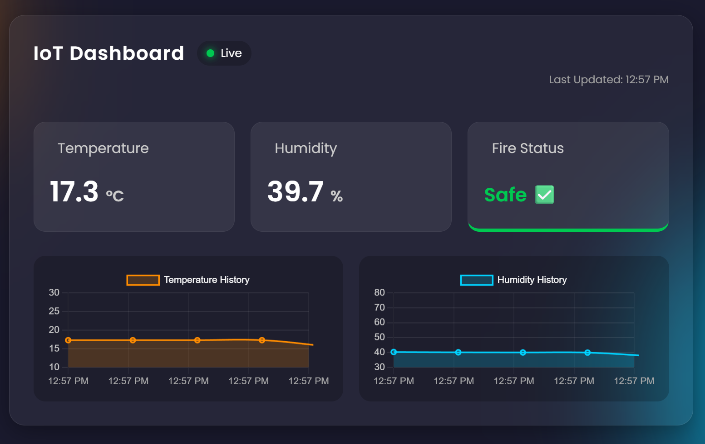
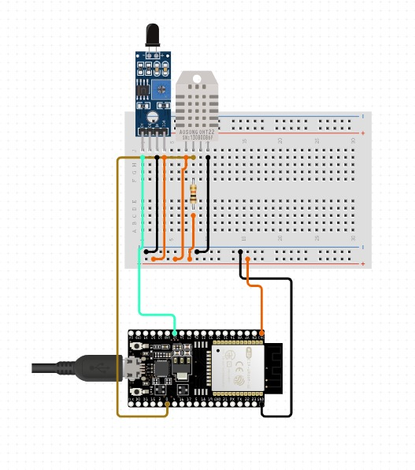
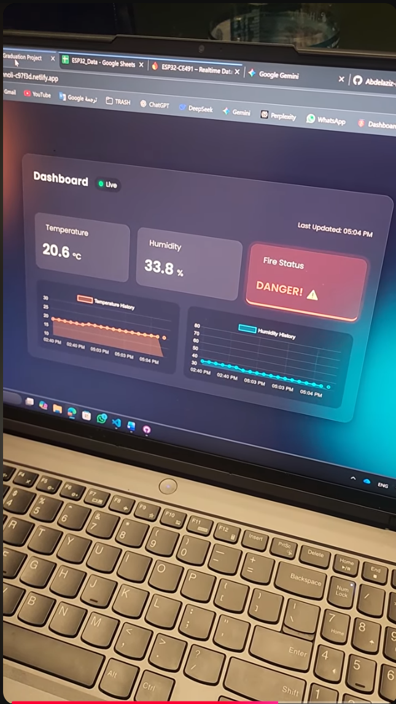

# 🛡️ IoT-Based Safety Module for Electric Heaters


## 📖 About
**IoT-Based Safety Module for Electric Heaters** is a real-time environmental monitoring system. It detects fire hazards, monitors temperature/humidity, and syncs data instantly to a web dashboard, Telegram, and Google Sheets.


## ✨ Features
* **🔥 Fire Detection:** Immediate alerts via Flame Sensor.
* **📊 Web Dashboard:** Real-time monitoring with historical charts (Glassmorphism UI).
* **📱 Telegram Alerts:** Push notifications for critical events (Fire, High Temp).
* **☁️ Dual Cloud Logging:**
    * **Firebase:** For real-time dashboard sync.
    * **Google Sheets:** For long-term history logging.



## 🏗️ System Architecture
This diagram illustrates the high-level communication between the ESP32, sensors, and the cloud platforms (Firebase, Telegram, Google Sheets).


## 🛠️ Hardware
* **ESP32 DevKit V1**
* **DHT22 Sensor** (Pin D27)
* **IR Flame Sensor** (Pin D14)



## ⚙️ System Logic
This flowchart illustrates how the system manages sensors, connectivity, and decision-making (Main loop).


## 🚀 Setup & Configuration

### 1. Firmware (ESP32)
* Rename `include/config_example.h` to `config.h`.
* Update `config.h` with your **WiFi**, **Firebase**, and **Telegram** credentials.

### 2. Backend (Google Sheets)
1. Create a Google Sheet and open **Extensions > Apps Script**.
2. Paste the code from `google_script/code.gs` and replace `YOUR_SPREADSHEET_ID`.
3. Deploy as **Web App** (Access: "Anyone") and copy the **URL** to `config.h`.

### 3. Frontend (Dashboard)
* Open `data/script.js` and update the **Firebase Configuration** section with your project keys.

### 2. Dashboard Setup (Frontend)
1. Go to `data/` folder.
2. Open `script.js`.
3. Locate the **Firebase Configuration** section at the top.
4. Replace the placeholder values with your own Firebase Web App config keys.

### 3. Uploading
1. Connect ESP32 via USB.
2. Upload the **Firmware** (Code) via PlatformIO (➡️ button).
3. Upload the **Filesystem Image** (to save HTML/CSS to ESP32).
4. Monitor output at Baud Rate **115200**.

## 📂 Project Structure

```text
CE492-Project/
├── data/                              # Web Dashboard files (HTML/CSS/JS)
│   ├── index.html
│   ├── script.js
│   └── style.css
├── google_script/                     # Google Apps Script for logging data to Google Sheets
│   └── code.gs
├── include/                           # Header files (*.h)
│   ├── cloud_manager.h                # General cloud communication logic
│   ├── firebase_manager.h             # Firebase Realtime Database integration
│   ├── ota_manager.h                  # Over-the-Air update management
│   ├── rtos_queues.h                  # FreeRTOS queue definitions for task communication
│   ├── sensor_manager.h               # DHT22 and Flame sensor handling
│   └── telegram_manager.h             # Telegram Bot API integration
├── src/                               # Source files (*.cpp)
│   ├── main.cpp                       # Entry point and FreeRTOS task initialization
│   ├── cloud_manager.cpp
│   ├── firebase_manager.cpp
│   ├── ota_manager.cpp
│   ├── rtos_queues.cpp
│   ├── sensor_manager.cpp
│   └── telegram_manager.cpp
├── firmware.bin                       # Compiled firmware binary for deployment
├── platformio.ini                     # Project configuration and library dependencies
├── version.json                       # Version control file for OTA updates
```

## 🎥 Live Demo
Click the image below to watch the system in action:

[](https://youtube.com/shorts/E3eaTCnOFkE?si=o2KrPO3ONYSjpmWO)
